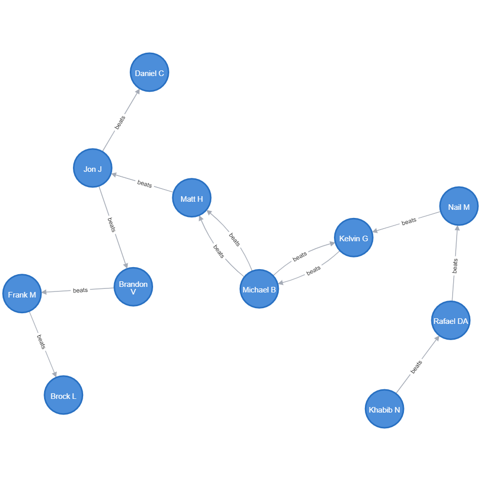
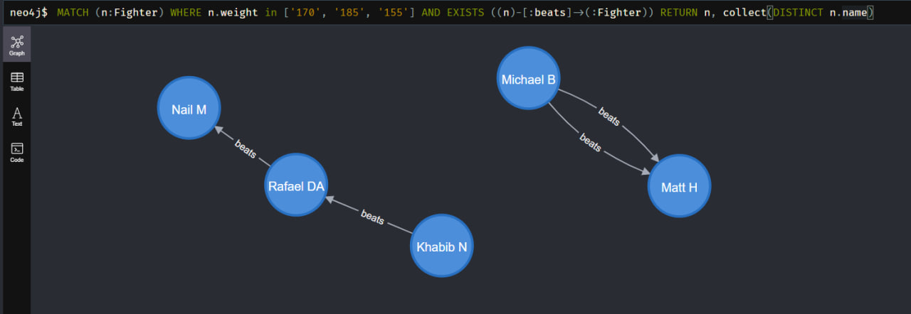
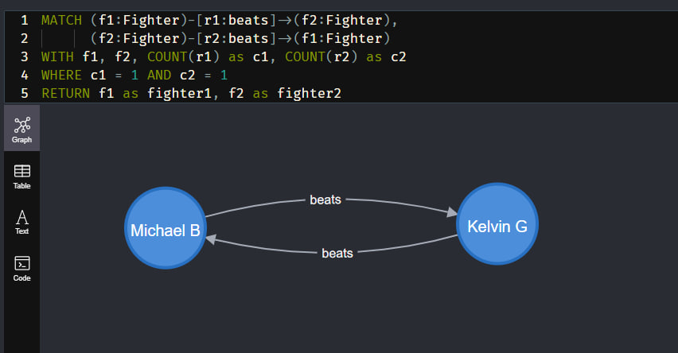
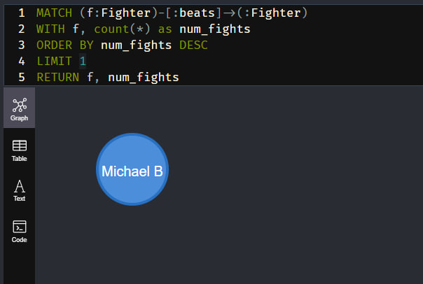
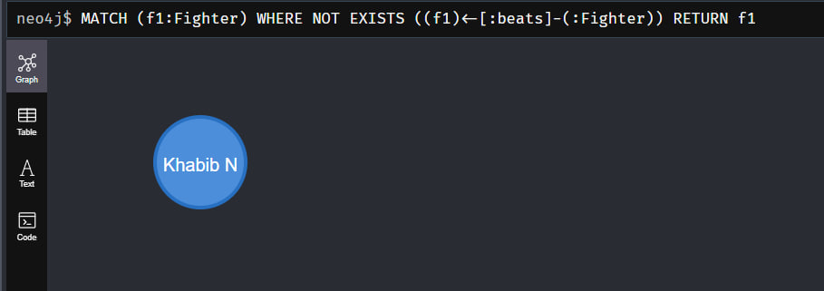
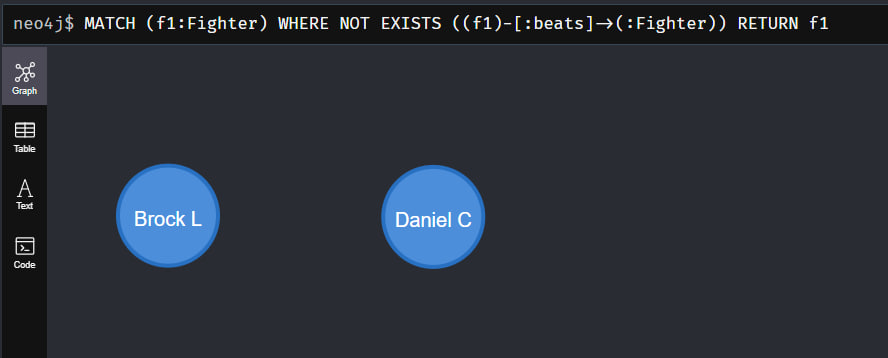
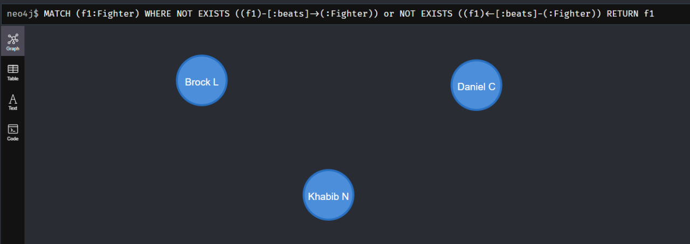

# Create DB
```
CREATE
(k:Fighter {name: 'Khabib N',weight:'155'}), 
(r:Fighter {name: 'Rafael DA',weight:'155'}),
(k)-[:beats]->(r),
(n:Fighter {name: 'Nail M',weight:'170'}),
(r)-[:beats]->(n),
(j:Fighter {name: 'Jon J',weight:'205'}),
(d:Fighter {name: 'Daniel C',weight:'205'}),
(j)-[:beats]->(d),
(mi:Fighter {name: 'Michael B',weight:'185'}),
(ma:Fighter {name: 'Matt H',weight:'185'}),
(mi)-[:beats]->(ma),
(bv:Fighter {name: 'Brandon V',weight:'205'}),
(j)-[:beats]->(bv),
(fm:Fighter {name: 'Frank M',weight:'230'}),
(bv)-[:beats]->(fm),
(bl:Fighter {name: 'Brock L',weight:'230'}),
(fm)-[:beats]->(bl),
(kg:Fighter {name: 'Kelvin G',weight:'230'}),
(n)-[:beats]->(kg),
(kg)-[:beats]->(mi),
(mi)-[:beats]->(ma),
(mi)-[:beats]->(kg),
(ma)-[:beats]->(j)
```


# 1
```
MATCH (n:Fighter) WHERE n.weight in ['170', '185', '155'] AND EXISTS ((n)-[:beats]->(:Fighter)) RETURN n, collect(DISTINCT n.weight)

```


# 2
```
MATCH (f1:Fighter)-[r1:beats]->(f2:Fighter),
      (f2:Fighter)-[r2:beats]->(f1:Fighter)
WITH f1, f2, COUNT(r1) as c1, COUNT(r2) as c2
WHERE c1 = 1 AND c2 = 1
RETURN f1 as fighter1, f2 as fighter2

```


# 3
```
MATCH (f:Fighter)-[:beats]->(:Fighter)
WITH f, count(*) as num_fights
ORDER BY num_fights DESC
LIMIT 1
RETURN f, num_fights

```


# 4.1
```
MATCH (f1:Fighter) WHERE NOT EXISTS ((f1)<-[:beats]-(:Fighter))
RETURN f1

```


# 4.2
```
MATCH (f1:Fighter) WHERE NOT EXISTS ((f1)-[:beats]->(:Fighter))
RETURN f1

```


# 4.3
```
MATCH (f1:Fighter) WHERE NOT EXISTS ((f1)-[:beats]->(:Fighter)) or NOT EXISTS ((f1)<-[:beats]-(:Fighter))
RETURN f1

```
